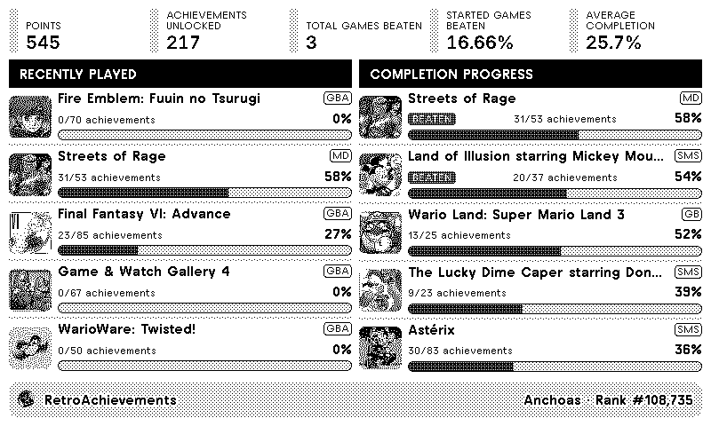
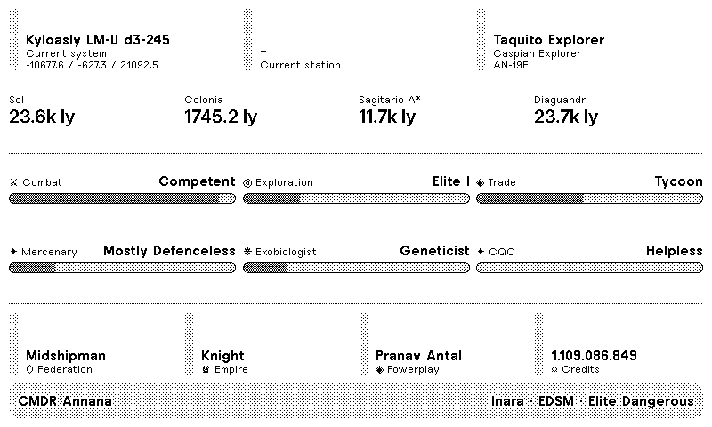
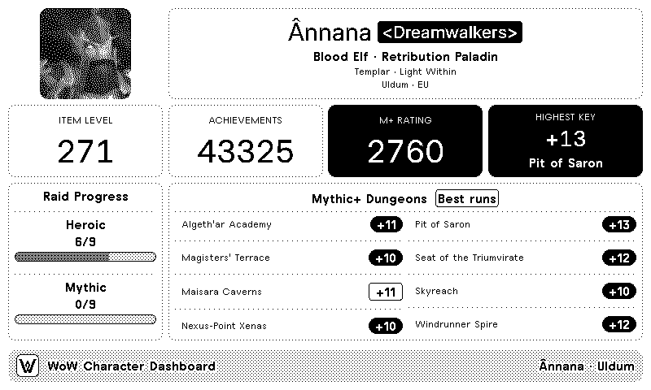
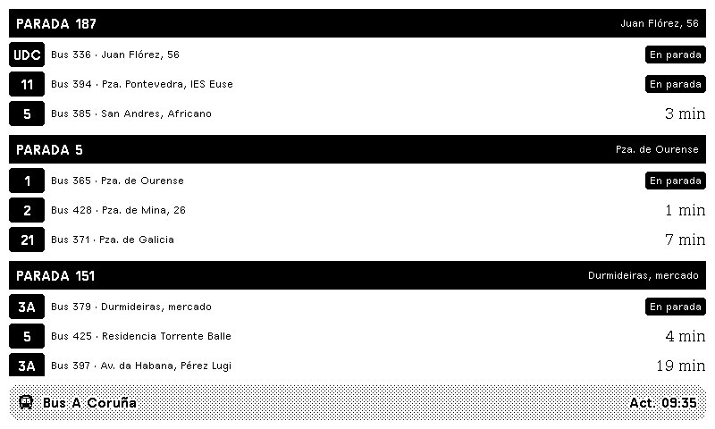

# TRMNL Plugin Support

Support and bug reporting for TRMNL plugins created by **Annana90**.

This repository is used **only for support and issue tracking**. The source code for the plugins is not hosted here.

## Supported plugins

- RetroArchTRMNL
- EDTRMNL Dashboard
- WoW Character Dashboard
- ITranvias - Bus A Coruña

### RetroArchTRMNL

Displays your RetroAchievements profile, recently played games, completion progress, and latest unlocked achievements directly on your TRMNL device.

- [Install on TRMNL](https://trmnl.com/recipes/374801)
- [Report an issue](https://github.com/Annana90/AnnanaTRMNLPluginSupport/issues/new?template=bug_report.yml)

### EDTRMNL Dashboard

Displays your Elite Dangerous commander profile, current location, active ship, rank progression, exploration data, and distances to key galactic landmarks.

- Install on TRMNL: Coming soon
- [Report an issue](https://github.com/Annana90/AnnanaTRMNLPluginSupport/issues/new?template=bug_report.yml)

### WoW Character Dashboard

Displays your World of Warcraft character profile, including level, race, class, faction, equipped gear, item level, and progression data.

- [Install on TRMNL](https://trmnl.com/recipes/377601)
- [Report an issue](https://github.com/Annana90/AnnanaTRMNLPluginSupport/issues/new?template=bug_report.yml)

### ITranvias - Bus A Coruña

Displays real-time bus arrival information for selected stops in A Coruña using data from iTranvías.

- [Install on TRMNL](https://trmnl.com/recipes/312018)
- [Report an issue](https://github.com/Annana90/AnnanaTRMNLPluginSupport/issues/new?template=bug_report.yml)

## Report a problem

Before opening an issue:

1. Check that your plugin settings are complete and correct.
2. Refresh the plugin manually in TRMNL.
3. Check whether a similar issue has already been reported.

When reporting a problem, please include:

- The plugin name
- Your TRMNL device model and screen size
- A clear description of what happened
- What you expected to happen
- A screenshot, when possible
- Any error message shown by TRMNL

Please do **not** include passwords, API keys, tokens, webhook URLs, or other private information.

[Open a bug report](https://github.com/Annana90/AnnanaTRMNLPluginSupport/issues/new?template=bug_report.yml)

## Feature requests

Suggestions are welcome, although new features are not guaranteed.

[Request a feature](https://github.com/Annana90/AnnanaTRMNLPluginSupport/issues/new?template=feature_request.yml)

## Contact

For plugin support, please use the **Issues** section of this repository.
